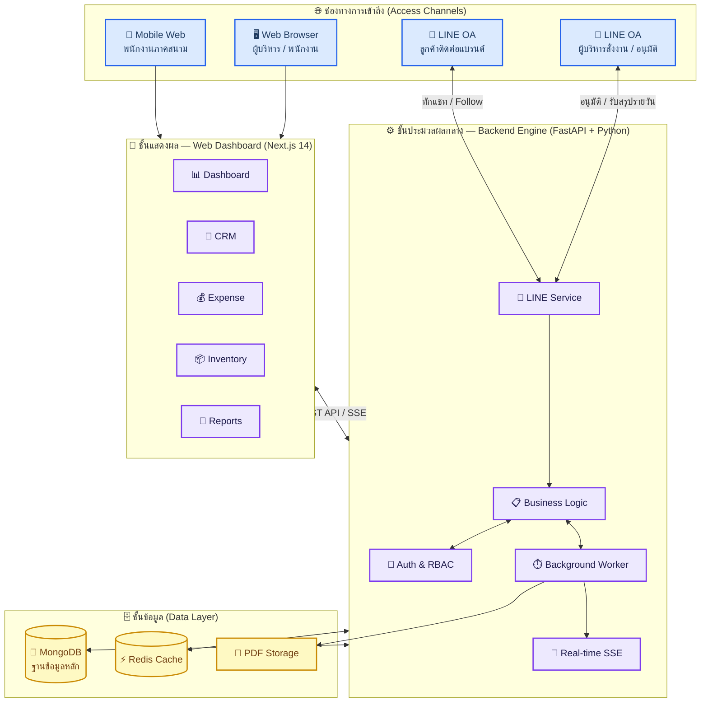
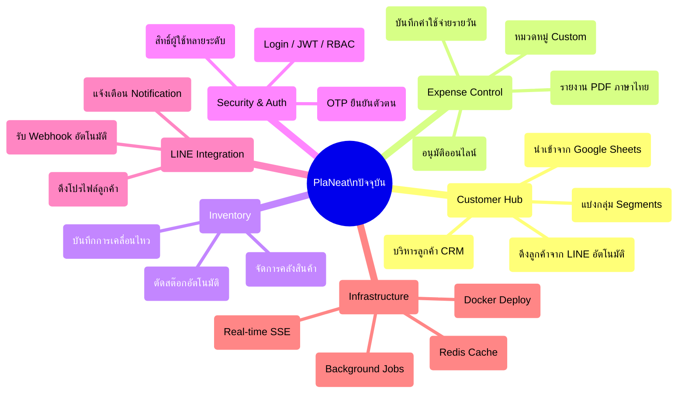
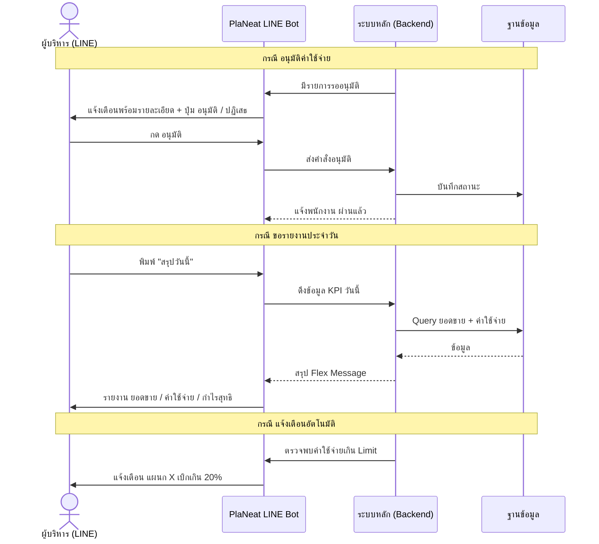
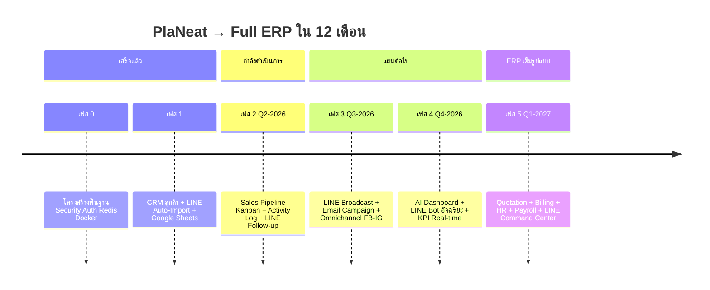
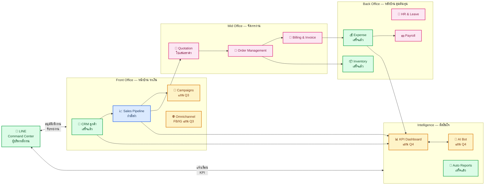
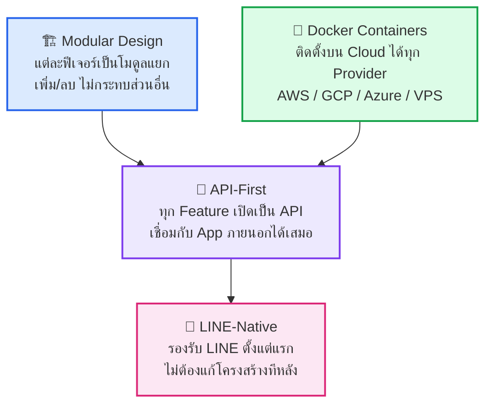
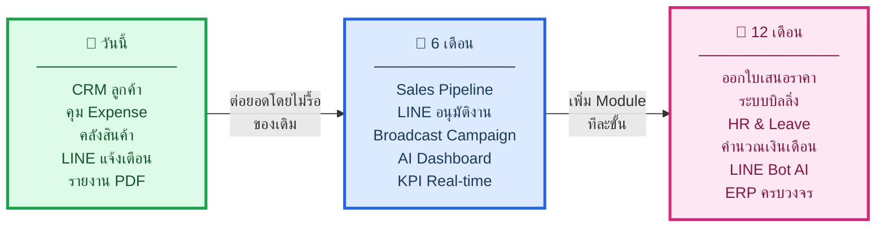

# 🏢 PlaNeat — แผนสถาปัตยกรรมระบบและทิศทางสู่ ERP เต็มรูปแบบ
### ฉบับผู้บริหาร (Executive Blueprint) | อัปเดต: เมษายน 2026

---

## 📌 บทสรุปสำหรับผู้บริหาร (Executive Summary)

> **PlaNeat** เริ่มต้นจากระบบควบคุมค่าใช้จ่ายภายในองค์กร และ**กำลังวิวัฒน์ขึ้นเป็นแพลตฟอร์มบริหารธุรกิจครบวงจร (Mini-ERP)** ที่ครอบคลุมตั้งแต่การหาลูกค้า ติดตามยอดขาย ไปจนถึงการออกเอกสารทางการเงิน — ทั้งหมดสั่งงานและมอนิเตอร์ผ่าน **LINE** ได้โดยตรง

| หัวข้อ | รายละเอียด |
|---|---|
| **ระบบปัจจุบัน** | Web Dashboard + CRM + Expense + Inventory |
| **จุดเด่น** | เชื่อม LINE OA ตั้งแต่ต้น, ทำงานแบบ Real-time |
| **เป้าหมาย 12 เดือน** | ERP ครบวงจร: Quotation, Billing, HR, Payroll |
| **ช่องทางควบคุม** | Web Dashboard + LINE OA (ผู้บริหารสั่งงานผ่านไลน์ได้) |
| **รูปแบบ Deployment** | Cloud-ready Docker — ขยายได้ไม่จำกัด |

---

## 1. สถาปัตยกรรมระบบปัจจุบัน (Current Architecture)

ระบบถูกออกแบบแบบ **"Layered Architecture"** แบ่งออกเป็นชั้นชัดเจน ทำให้เพิ่มฟีเจอร์ได้โดยไม่กระทบส่วนอื่น

---

## 2. โมดูลที่ทำงานได้แล้ว (Completed Modules)

---

## 3. LINE ในฐานะ "Cockpit ผู้บริหาร" (LINE Command Center)

> **แนวคิดหลัก:** ผู้บริหารไม่ต้องเปิดคอมพิวเตอร์ — **อนุมัติ, รับรายงาน, สั่งงาน** ผ่าน LINE ได้ทันที เพราะทุกคนใช้ LINE อยู่แล้ว ไม่มีช่วงการเรียนรู้

### คำสั่ง LINE สำหรับผู้บริหาร

| คำสั่ง | ผลลัพธ์ |
|---|---|
| `สรุปวันนี้` | ยอดขาย + ค่าใช้จ่าย + กำไรสุทธิ ประจำวัน |
| `สรุปเดือนนี้` | ภาพรวมทางการเงินรายเดือน |
| `ดีลรออนุมัติ` | รายการที่รอผู้บริหารอนุมัติ |
| `สต๊อกวิกฤต` | สินค้าที่ใกล้หมดคลัง |
| `ลูกค้าใหม่วันนี้` | รายชื่อลูกค้าที่เพิ่งเข้ามา |
| `ตัวชี้วัดทีมขาย` | Win Rate, Pipeline Value, ยอดแต่ละเซลส์ |
| `✅ [รหัสรายการ]` | อนุมัติรายการที่แจ้งมา |
| `❌ [รหัสรายการ]` | ปฏิเสธพร้อมเหตุผล |

---

## 4. เส้นทางสู่ ERP (Transformation Roadmap)

---

## 5. ภาพรวม ERP ฉบับอนาคต (Target State)

**สัญลักษณ์:** 🟢 เสร็จแล้ว | 🔵 กำลังทำ | 🟡 แผน 6 เดือน | 🩷 แผน 12 เดือน

---

## 6. ผลลัพธ์ที่ได้ในแต่ละเฟส

| เฟส | ช่วงเวลา | สิ่งที่ได้ | ประโยชน์ธุรกิจ |
|---|---|---|---|
| **ปัจจุบัน ✅** | เสร็จแล้ว | CRM + Expense + Inventory + LINE Notify | รู้จักลูกค้า + คุมงบได้ |
| **เฟส 2 🔄** | Q2/2026 | Sales Pipeline + LINE Follow-up Reminder | ปิดดีลได้เร็วขึ้น ไม่พลาด Lead |
| **เฟส 3 📋** | Q3/2026 | LINE Broadcast + Email + FB/IG | ส่งโปรถึงลูกค้าเป้าหมายได้ทันที |
| **เฟส 4 📋** | Q4/2026 | AI Bot + KPI Dashboard Real-time | ผู้บริหารถามไลน์ได้เลย ไม่ต้องรอรายงาน |
| **เฟส 5 🚀** | Q1/2027 | Quotation + Billing + HR + Payroll | **ERP ครบวงจร ลดงาน Manual 80%** |

---

## 7. หลักการออกแบบที่ทำให้ขยายได้ไม่จำกัด

---

## 8. สรุปภาพรวม 3 ระยะ (One-Page Summary)

> [!IMPORTANT]
> **ข้อได้เปรียบเชิงกลยุทธ์:** PlaNeat ถูกสร้างให้ **ต่อยอดได้ทีละส่วน** โดยโครงสร้างที่วางไว้รองรับการเติบโตสู่ ERP เต็มรูปแบบโดยไม่ต้องเริ่มต้นใหม่ — ประหยัดต้นทุนการพัฒนาในระยะยาวได้อย่างมีนัยสำคัญ

> [!TIP]
> **LINE = "Cockpit ผู้บริหาร":** เพราะทีมงานใช้ LINE เป็นหลักอยู่แล้ว การฝัง Command Center เข้าไปใน LINE OA จึงไม่มีช่วงการเรียนรู้ — ผู้บริหารอนุมัติงานได้ทันทีโดยไม่ต้องเปิดหน้าต่างใหม่

---

*PlaNeat Executive Architecture Blueprint v2.0 | เมษายน 2026*
